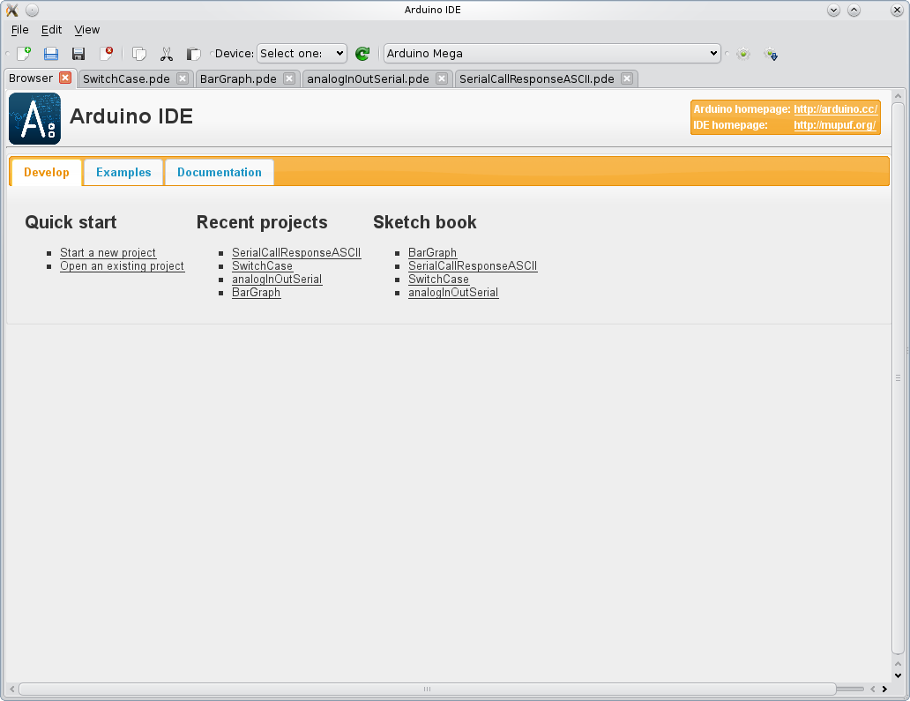
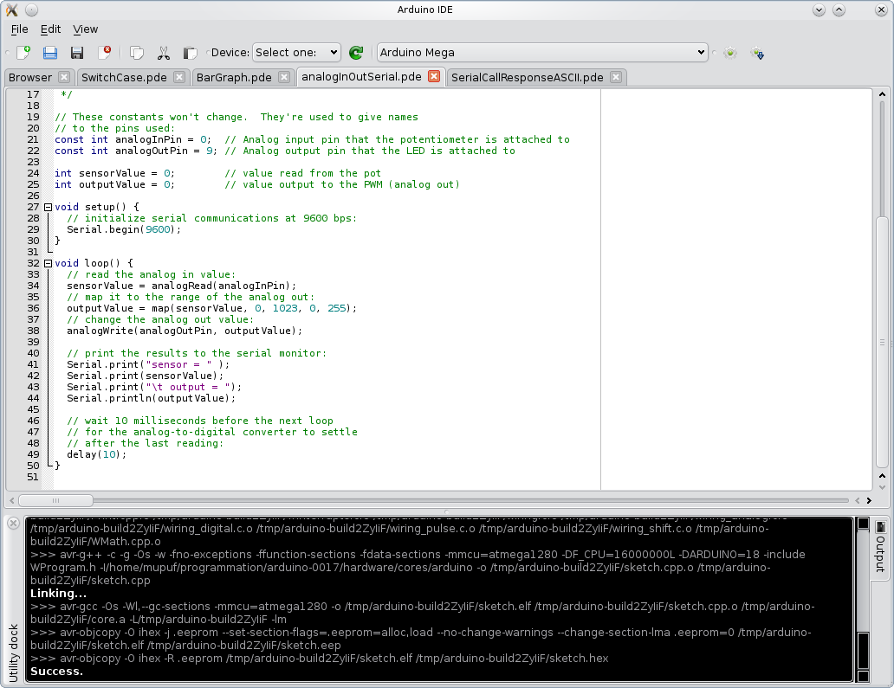
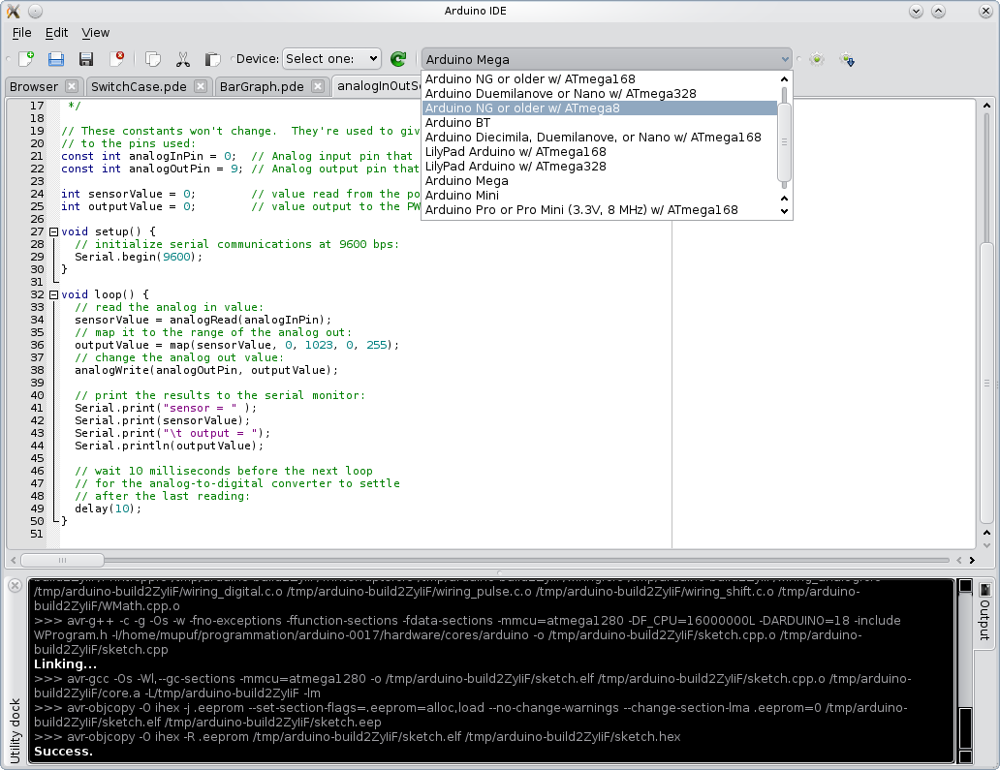
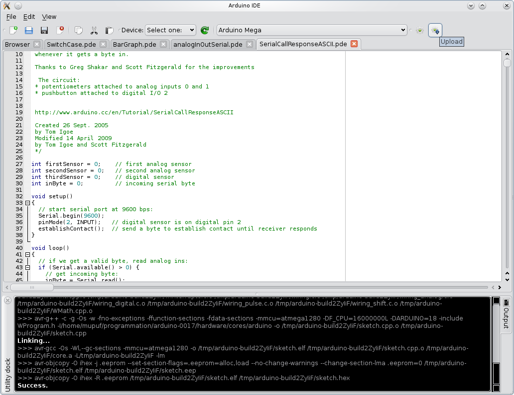
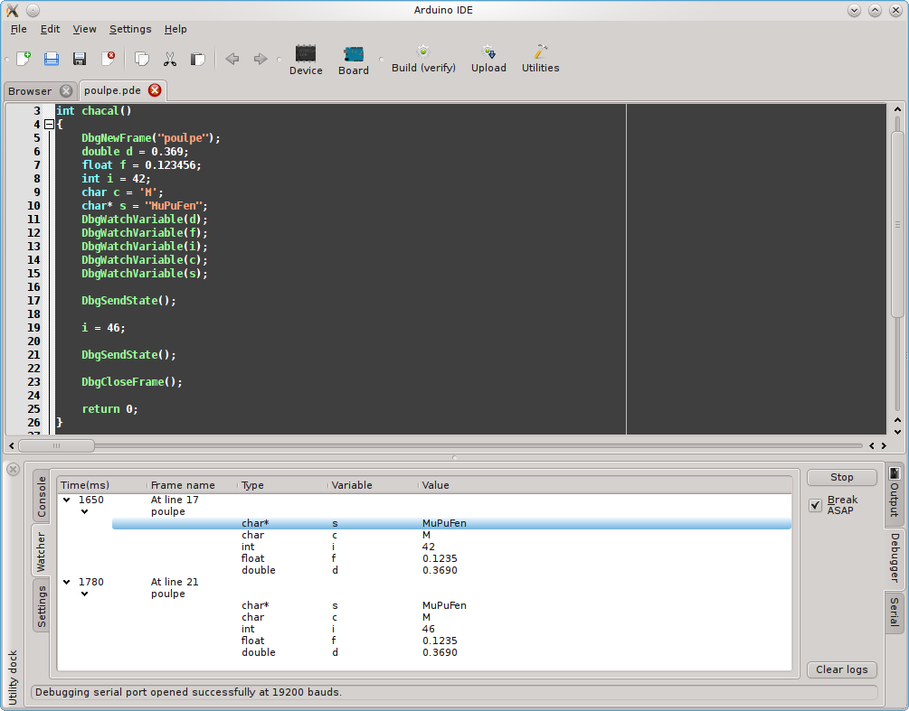
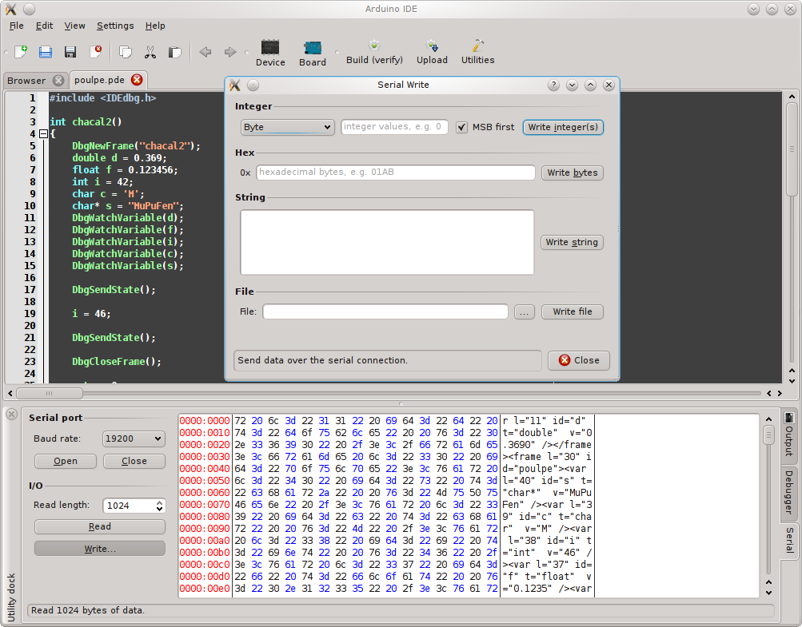

#  Arduide (a Qt-based Arduino IDE)

### Description

ArduIDE is a Qt-based IDE for the open-source [Arduino] electronics prototyping platform.

This project is an attempt to provide an alternative to the original Java IDE. It is faster and provides a richer feature set for experienced developers.

### Media
Here is a [video of the IDE][arduide_video].

<div id="pattern" class="pattern">
  <ul class="g">
    <a href="#"></a>
    <a href="#"></a>
    <a href="#"></a>
    <a href="#"></a>
    <a href="#"></a>
    <a href="#"></a>
</ul>
</div>

### Dependencies
Arduide depends on the following projects:

* [QScintilla2] - Qt port of Scintilla.
* [Grantlee] - A library to separate structure of documents from the data they contain.
* [Libudev] - Allows access to device information.
* [Qt4] - Cross-platform application framework.
* [cmake] - Manage build process.
* [Doxygen] - Documentation generator

Here are the names of the packages needed for some distributions (subject to changes).

#### Arch Linux
```sh
$ sudo pacman -S qt4 qtwebkit qscintilla grantlee udev cmake git doxygen
```
#### Debian
```sh
$ sudo apt-get install libqscintilla2-dev libudev-dev libgrantlee-dev libgrantlee-core0 qt4-qmake cmake git doxygen
```

### Instalation

```
$ git clone https://git.gitorious.org/arduide/arduide.git
$ cd arduide && mkdir build && cd build
$ cmake -DCMAKE_INSTALL_PREFIX=/usr -DUSE_FHS_PATHS=ON -DCMAKE_BUILD_TYPE=Release ..
$ make
# make install
```

## Contributing


1. Fork it.
2. Create a branch (`git checkout -b my_markup`)
3. Commit your changes (`git commit -ams "Added something very cool"`)
4. Push to the branch (`git push origin my_markup`)
5. Open a [Pull Request]
6. Enjoy a good book and wait :book:

## Links
See: http://mupuf.org/project/arduide/

[Arduino]: <http://www.arduino.cc/>
[arduide_video]: <http://fs.mupuf.org/arduide-2.ogv>

[QScintilla2]: http://www.riverbankcomputing.co.uk/software/qscintilla/intro
[Grantlee]: https://www.gitorious.org/grantlee/pages/Home
[Libudev]: http://www.freedesktop.org/software/systemd/libudev/
[Qt4]: https://qt.digia.com/
[cmake]: http://www.cmake.org/
[Doxygen]: http://www.stack.nl/~dimitri/doxygen/

[Pull Request]: https://github.com/mupuf/arduide/pulls
